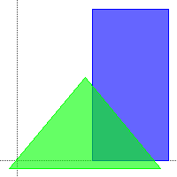
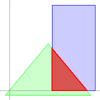
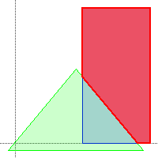
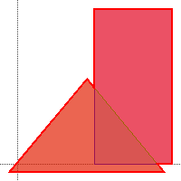
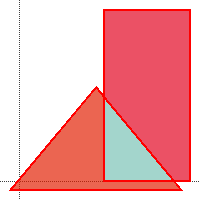

# polygon clipping

[](https://circleci.com/gh/random-dwi/polygonclipping/tree/master)
[](https://maven-badges.herokuapp.com/maven-central/com.github.random-dwi/polygon-clipping)

## Description
A library for polygon clipping written in Java.
It implements the algorithm described in the paper `F. Martínez, A.J. Rueda, F.R. Feito. A new algorithm for computing Boolean operations on polygons. Computers & Geosciences, 35 (2009) `

### Features

Polygon

## Maven Dependency

```xml
<dependency>
    <groupId>com.github.random-dwi</groupId>
    <artifactId>polygon-clipping</artifactId>
    <version>1.0</version>
</dependency>
```

## Examples

```java
Polygon subject = new Polygon(new File("/polygons/samples/rectangle1"));
Polygon clipping = new Polygon(new File("/polygons/samples/triangle2"));

Polygon result1 = BooleanOperation.INTERSECTION.of(subject, clipping);
Polygon result2 = BooleanOperation.DIFFERENCE.of(subject, clipping);
Polygon result3 = BooleanOperation.UNION.of(subject, clipping);
Polygon result4 = BooleanOperation.XOR.of(subject, clipping);
```

| ORIGINAL   | INTERSECTION | DIFFERENCE | UNION      | XOR          |
| ---------- | ------------ | ---------- | ---------- | ------------ |
|  ||  ||  |
