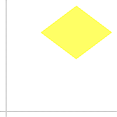
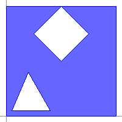

# polygon clipping

[](https://circleci.com/gh/random-dwi/polygonclipping/tree/master)
[](https://maven-badges.herokuapp.com/maven-central/com.github.random-dwi/polygon-clipping)

## Description
A library for polygon clipping written in Java.
It implements the algorithm described in the paper `F. Martínez, A.J. Rueda, F.R. Feito. A new algorithm for computing Boolean operations on polygons. Computers & Geosciences, 35 (2009) `

### Features

* Boolean operations on polygons with double precision
* Supports complex polygons with holes

## Maven Dependency

```xml
<dependency>
    <groupId>com.github.random-dwi</groupId>
    <artifactId>polygon-clipping</artifactId>
    <version>1.0.1</version>
</dependency>
```

## Examples

### Apply boolean operation

```java
Polygon subject = new Polygon(new File("/polygons/samples/rectangle1"));
Polygon clipping = new Polygon(new File("/polygons/samples/triangle2"));

Polygon result1 = BooleanOperation.INTERSECTION(subject, clipping);
Polygon result2 = BooleanOperation.DIFFERENCE(subject, clipping);
Polygon result3 = BooleanOperation.UNION(subject, clipping);
Polygon result4 = BooleanOperation.XOR(subject, clipping);
```

| ORIGINAL   | INTERSECTION | DIFFERENCE | UNION      | XOR          |
| ---------- | ------------ | ---------- | ---------- | ------------ |
|  ||  ||  |

### Create polygons

#### Simple polygon
##### Code
```java
double[][] points = {{2.5,7.5}, {5.0, 5.0}, {7.5, 7.5}, {5.0, 10.0}};
Polygon p = Polygon.from(points);
```
##### Result

        
#### Polygon with holes
##### Code
```java
double[][] outerContour = {{0.0,0.0}, {10.0, 0.0}, {10.0, 10.0}, {0.0, 10.0}};
double[][] hole1 = {{0.5,0.5}, {4.0, 0.5}, {2.0, 4.0}};
double[][] hole2 = {{2.5,7.5}, {5.0, 5.0}, {7.5, 7.5}, {5.0, 10.0}};

Polygon p = Polygon.from(Contour.from(outerContour), Contour.from(hole1), Contour.from(hole2));
```
##### Result


